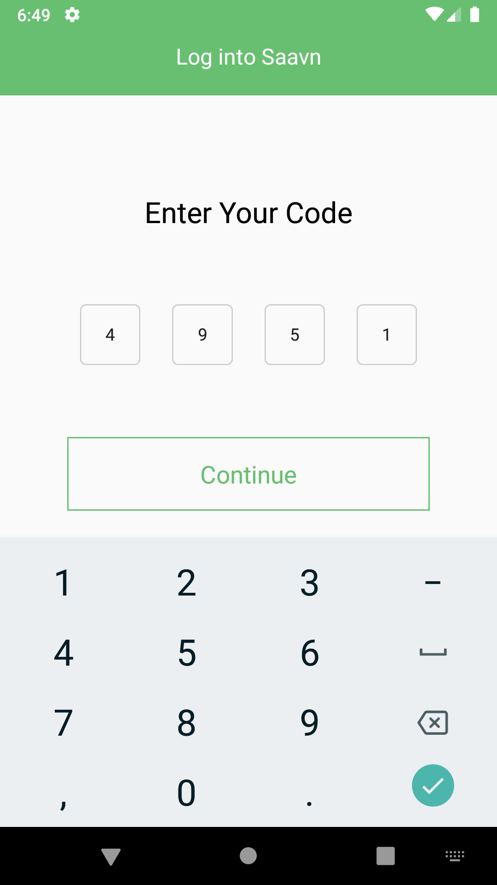
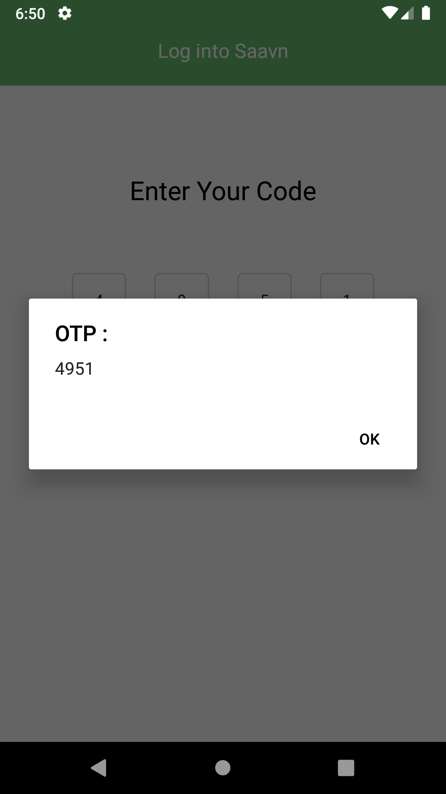
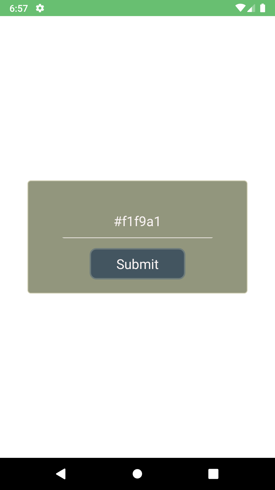
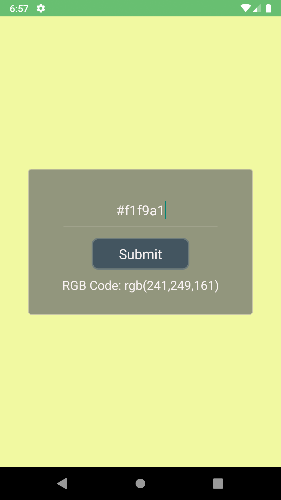
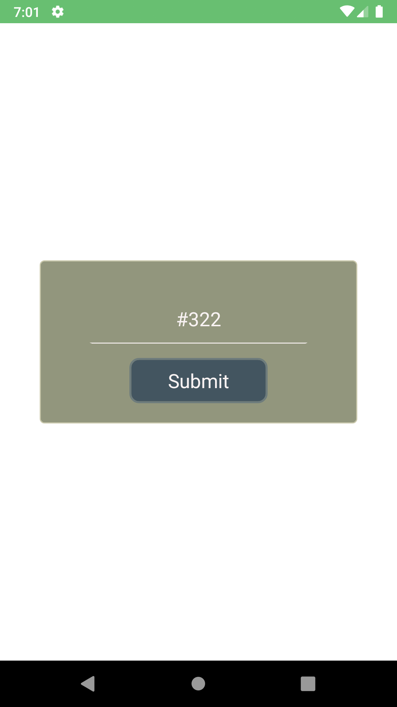
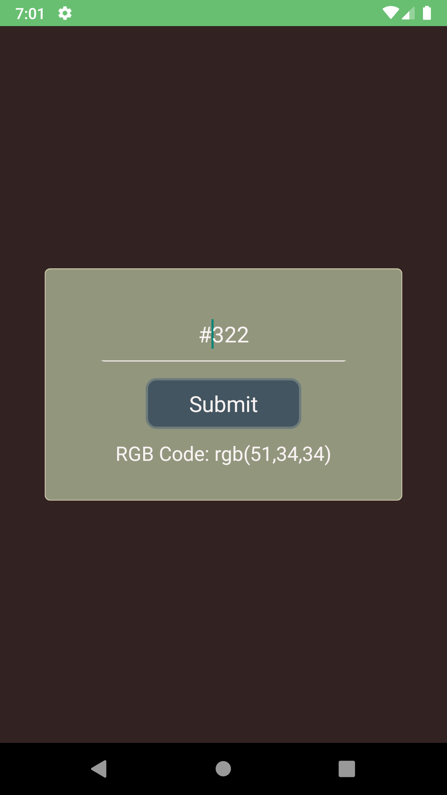
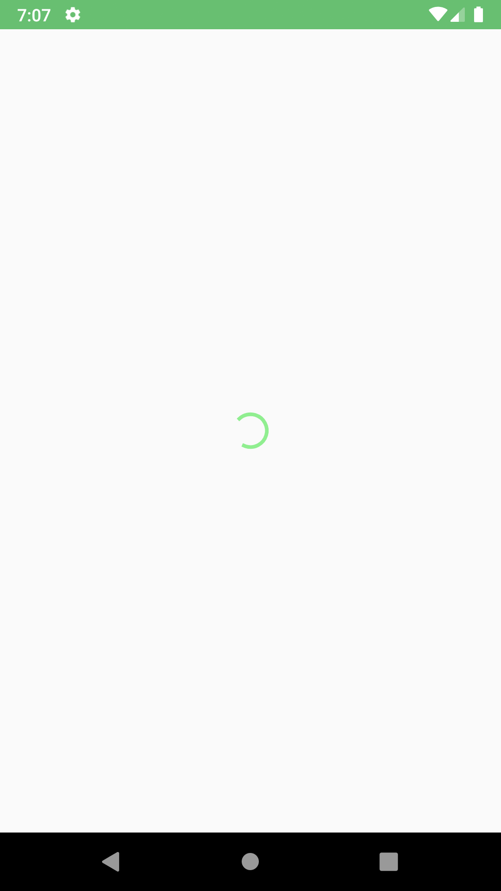

># React Native Components 1 (Assignment)
> ## Date: 03-03-21   
>### [Assignment Doc File Link](https://docs.google.com/document/d/1W2O1i7U4Vjb38tbCAFljowz1w3KeTzTq7DI53qIAOAE/edit?usp=sharing)
> <br>

<br>

> ## <ins>How to Run Programs</ins>
>If you wish to run Question 2, go to App.js and then change the following code from  
>```js
>        <Question1/>
>    {/* <Question2/>  */}
>    {/* <Question3/> */}
>```
>to
>```js
>    {/*<Question1/> */}
>       <Question2/>  
>    {/* <Question3/> */}
>```
>similarly with Question 3, change the code to
>```js
>    {/*<Question1/> */}
>    {/* <Question2/> */}
>       <Question3/>  
>``` 

<br>

> ## <ins>Question 1:</ins> 
> ### Create the screen with design given in the link below alongwith background  image.
> [Image](https://drive.google.com/file/d/1ot21Mo6zOgiY1gkDPyLw82FKe82eSXws/view?usp=sharing)
>
>### Output: 
>
>  &nbsp;
> 

<br> 

> ## <ins>Question 2:</ins> 
> ### Create a text input , text and view alongwith the following steps:-
> - You will input the hex code of a color, and validate that hexcode on submit.
> - If it is a valid hex code convert it into RGB and show its value in the Text
> - Give that RGB value as background color for the View.
>
>### Output: 
>
> &nbsp;
>
>
><br>
>
> &nbsp;
>

<br>

>## <ins>Question 3:</ins> 
> ### Create a image view and show activity indicator in place of image while it is loaded.
>
>### Output:
>
> &nbsp;
>
