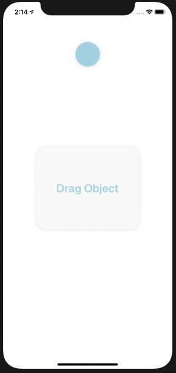

> # React Native Components - 6 Assignment

> ## Create a Draggable Ball on View
>
> </img>

> ## Create a map view
>
> ### 1. Show your current location
>
> ### 2. Set your current location on drag i.e, current location functionality in zomato application.
>
> ### 3. Create an array of some static coordinates and show marker for those coordinates on map view.
>
> </img>
