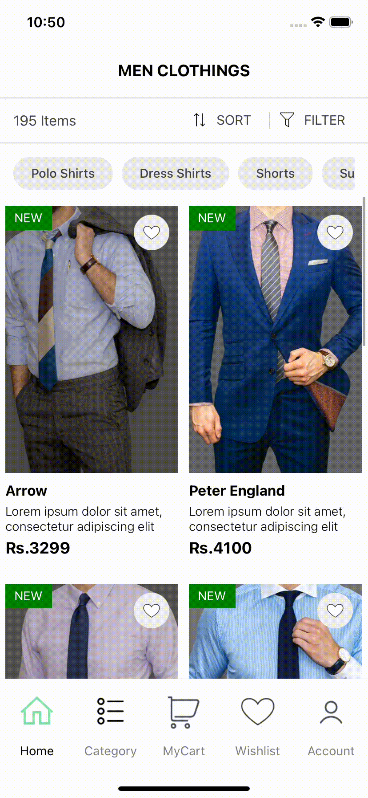

># React Native Components 3 - Assignment

> ## Create the [Screen](https://drive.google.com/file/d/11w9OJLKNSKM1sf_vrNcFaFjligyk7-Pi/view?usp=sharing) in React-Native   
> - Tab Navigation needs to integrated 
> - Home tab must be selected 
> - Icons can be fetched from icons8.com 
> - Sort, filter, wishlist should be touchable
> - No need for back icon  

> ## Output 
> </img>
>