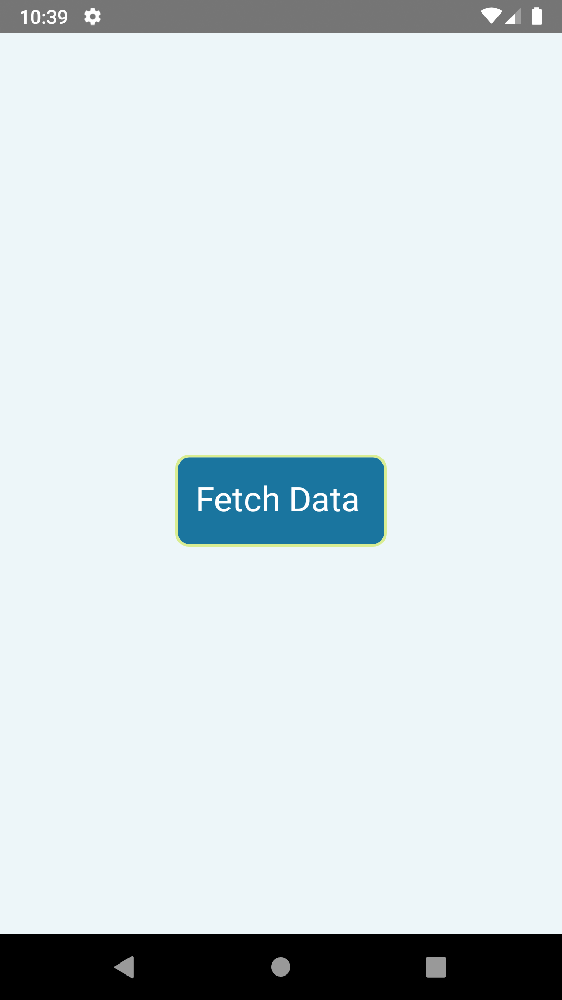
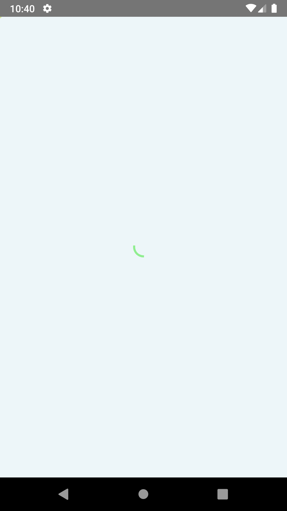

># React Native Debugging - Assignment 
>
  
> 
> ## Session: React-Native Debugging
>
> ### Create a new Screen   
> * Add a button FETCH Data  
> * On click present a loader and make an API call   
> * List the data on the same screen, existing button and loader should be removed
>
> API Path : https://reqres.in/api/users  
>
> ## <ins>How It Works: </ins>
> When you open the app you see a page with a button on it, on pressing the button, an api call is made and user cards are shown and the button is removed from the screen.  
> After the user cards are loaded, more user cards load into the screen once you reach the bottom of the list. 
>

> ## <ins>Output: </ins>
> </img>
> </img>
> </img>
> </img>