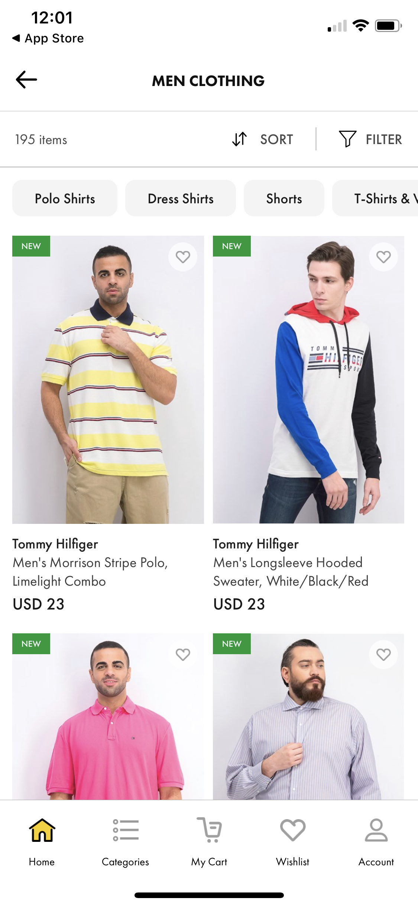

># React Native Components 3 - Assignment

> ## Create the below screen in React-Native 
> - Tab Navigation needs to integrated 
> - Home tab must be selected 
> - Icons can be fetched from icons8.com 
> - Sort, filter, wishlist should be touchable
> - No need for back icon     
> </img>

> ## Output 