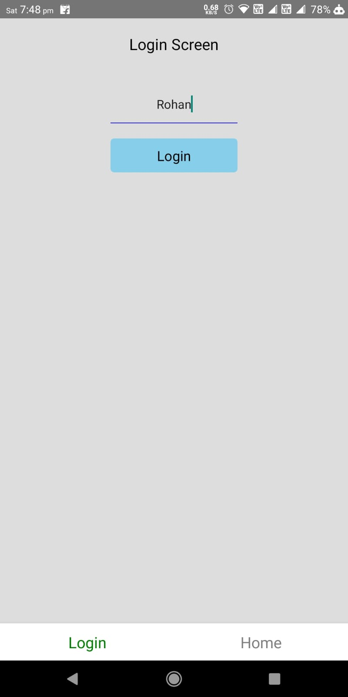
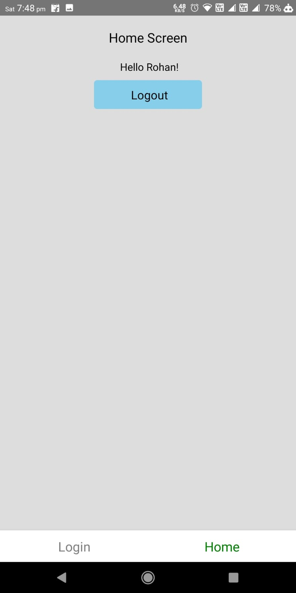

> # React-Native Navigations - Assignment    

>## Question: 
> - ### Create Stack, Tab and Drawer Navigator (optional)
> - ### Pass Props and Set it as header title
> 

> ### <ins>How it Works: </ins>
>To run diff. Navigations, uncomment & comment the following code.     
>
>To Open the Tabs Navigation : 
>```js 
> <StackComp />
> {/* <TabComp /> */}
>```
>
>To Open The Stack Navigation  
>```js 
>{/* <StackComp /> */}
><TabComp />
>```  
> 
>### <ins>Output: </ins>
></img>
>
></img>  
>
></img>
>
></img>  