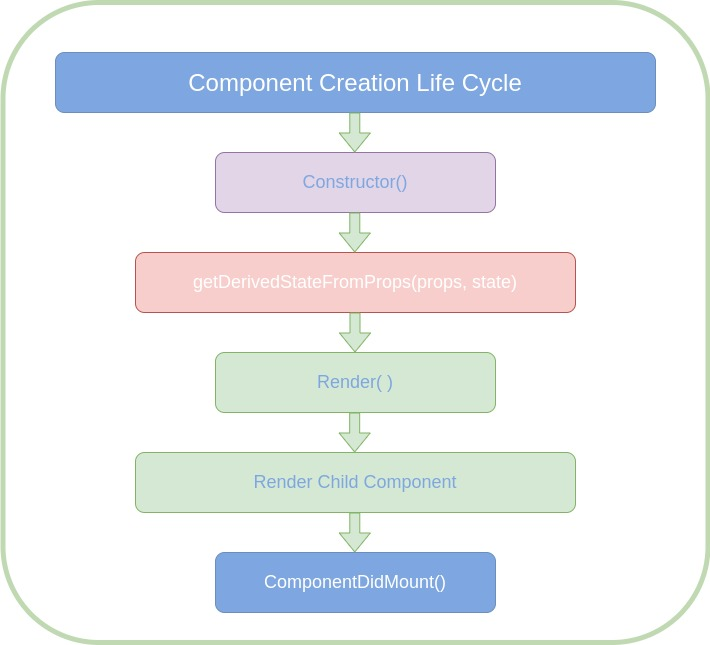
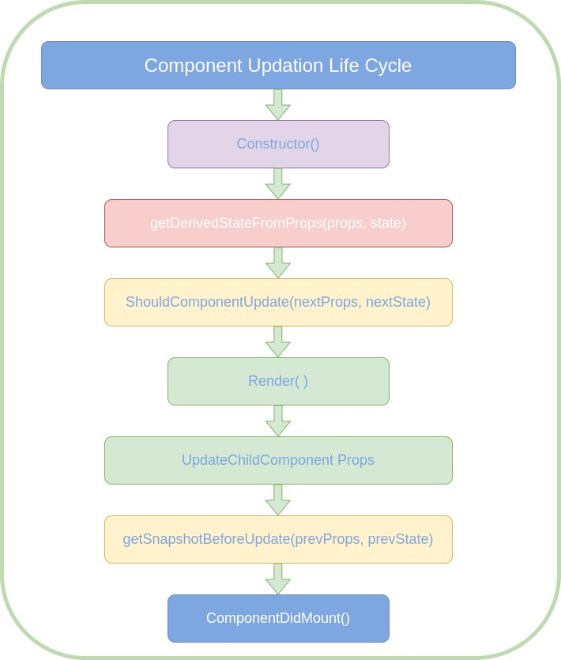

># React-Native Assignment - 1
>### [Assignment Doc File Link](https://docs.google.com/document/d/1W2O1i7U4Vjb38tbCAFljowz1w3KeTzTq7DI53qIAOAE/edit?usp=sharing)
>## Component Life Cycle
>### Component Lifecycle:  
>`**Only available in class based components.`
> - When a component is created, then `first the constructor executes.` It is the default  ES6 class feature, Not a React Lifecycle Hook. 
>
> - `getDerivedStateFromProps(props, state)`: This is a lifecycle hook, the idea here is that whenever your props change from your class-based component, you can sync your state to them.
> - `Render()`: After these two hooks, the render() executes. Use it only to prepare the data as you need it to lay out your JSX code and to render it.
> - `Render Child Components`: When rendering another react component in this class-based component, then these child components will now be rendered. So the child component you include in your rendered component will then be rendered as well and only all child components were rendered and that their lifecycle hook finished.
> - `ComponentDidMount()`: It is a very important lifecycle hook which we’ll use a lot when we’re working with class-based components, cause here we can use things like HTTP requests. We shouldn’t update our state here. 
>    
> 
>
> - `ShouldComponentUpdate()`: Allow us to cancel the update process. This should be used carefully because obviously, we can break our component, if we block an update from happening incorrectly but it is very powerful since it allows us to prevent unnecessary update cycles.
> - After the `Render()` is called and React then goes to JSX code, evaluates that and basically constructs its virtual DOM.
> - `getSnapshotBeforeUpdate(prevProps, prevState)`: So imagine that our upcoming update of our component will rerender the DOM and will add a new element on the DOM and you therefore want to restore the scrolling position of the user. Well then this method can give us that snapshot of the userState, so it will take a snap of the scrolling position right before the update happens and use that snapshot once the update is done to scroll the user back to where he was or anything like that.
>    
> 
