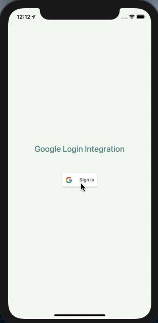

> # React Native - Social Integration Assignment

> ## Implement any one social login out of [Facebook](https://github.com/facebookarchive/react-native-fbsdk), [Google](https://github.com/react-native-google-signin/google-signin) & [Linkedin](https://github.com/xcarpentier/react-native-linkedin).

> ## Output
>
> ### IOS
>
> 
>
> ### Android
>
> 
