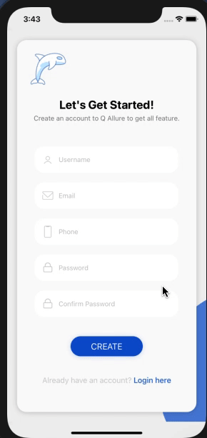

> # React Native Components 5 - Assignment

> ### Question:
>
> - Use Alert, intercept Back Press and show the text to confirm go back.
> - Use Clipboard to move text from one screen to another.

> ## Output
>
> </img>
