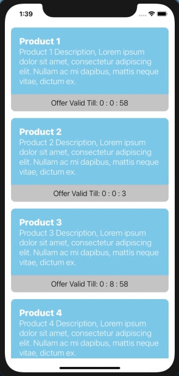
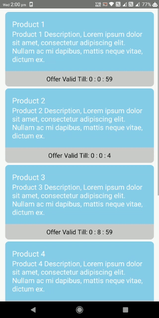

> # React Native Doubt Resolving Session - Assignment

> ## Create a react native screen diplaying a list with each item has a countdown timer on the basis of the timestamp.
>
> ### Conditions:-
>
> 1. If timestamp is less than the current time, show expired text instead of timer
> 2. Timer format will be hours, minutes and seconds i.e, 00:05:46
> 3. Implement UI of the list and JSON data as per your understanding.
>
> Note- <strong>Use moment.js library </strong>

> ### Output : iOS
>
> </img>    
>
> ### Output : Android
>
> </img>   [Reference](https://reactnativemaster.com/react-native-countdown-timer-example-using-momentjs)
